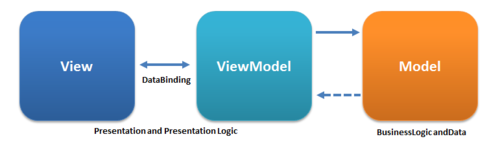

# SpeechToText

This project was developed to demonstrate the usage of SwiftUI and Combine with the MVVM pattern. This project allows the user record an audio and receive the speech to text response processed via the Google Speech-To-Text API.

# Demo

# MVVM

This project is based on the MVVM (Model-View-View-Model) architecture that could be represented by this chart.

## Model

The Model layer is responsivle for respresenting the data from your business logic and decode a JSON response from the server.

## View

The View layer is responsible for handling all the layout related code, such as displaying the data and ask for the data.

## ViewModel

The ViewModel is responsible for transforming the data receveid in a View representative way and receive the actions from the View

## Layer Separation

The View holds the ViewModel. but the ViewModel do not know anything about the View and the ViewModel Knows about the Model, and the Model do not know about the ViewModel. To send data from the ViewModel to the View, we use combine as a DataBinder to handle those changes.

# Instalation

This project uses the SwiftPackagerManager for the Lottie library. For assuring that everything is working, run the commands bellow:

- Clear the build folder ⌘ + Shift + K
- Restart Xcode

This project is based on the Google Speech-To-Text API, for successfully run, you should insert your api key on the `GoogleCloud.swift` file:

# Folder Structure
The app is organized on the following structure:

## Components
This folder contains all the reusable components, such as a `RoundedButton`

## Configuration
This folder contains the `GoogleCloud` configuration, where we store the `APIKEY`

## Services
This folder contains all the Services from the app: The `SpeechManager`, `AudioRecorderManager` and the `AudioPlayerManager`

## Scenes
This folder contains all the features of the app, each subfolder should contain all the `MVVM` structure

### Speech
This folder contains all ther Speech feature related code

#### Views
This folder contains all the `View` related code

#### Models
This folder contains all the `Model` related code

#### ViewModels
This folder contains all the `ViewModel` related code

## Resources
This folder contains the Application related code, such as the `xcassets`, `info.plist`, and the `AppFile`